# Criando um Chatbot Baseado em Conteúdo de PDFs 

---

### Cenário

Imagine que você é um estudante de Engenharia de Software, prestes a escrever seu Trabalho de Conclusão de Curso (TCC). Para isso, você precisa revisar e correlacionar diversos artigos científicos. Entretanto, à medida que acumula mais documentos, torna-se cada vez mais difícil extrair informações relevantes e conectar ideias entre diferentes textos.

Diante desse desafio, você decide utilizar inteligência artificial para facilitar esse processo, criando um sistema de busca inteligente capaz de interpretar os PDFs, organizar informações e gerar respostas relevantes com base no conteúdo carregado.

### Objetivo

O objetivo deste projeto é permitir que você:

- 📅 Carregue arquivos PDF contendo informações relevantes para seu estudo ou projeto.
- 🔖 Implemente um sistema de busca vetorial para indexar e recuperar informações dos PDFs.
- 📦 Utilize inteligência artificial para gerar respostas baseadas no conteúdo dos documentos carregados.
- 🔄 Desenvolva um chat interativo onde seja possível realizar perguntas e obter respostas contextuais fundamentadas nos arquivos.

### Como entregar esse projeto?

1. Criar um novo repositório no GitHub com um nome de sua preferência.
2. Criar uma pasta chamada **inputs** e adicionar um documento de texto com algumas sentenças.
3. Criar um arquivo chamado **README.md**, deixe alguns prints descreva o processo, alguns insights e possibilidades que você aprendeu durante o conteúdo após a IA analisar suas sentenças
4. Compartilhar o link do repositório através do botão "entregar projeto".

---

## Desenvolvimento do Projeto

Neste projeto criei um chatboot a partir do Azure IA Foundry para pesquisar o tema Saúde Mental utilizando como referência artigos coletados da internet.

## Criando Hub
  Iniciei criando um hub.
    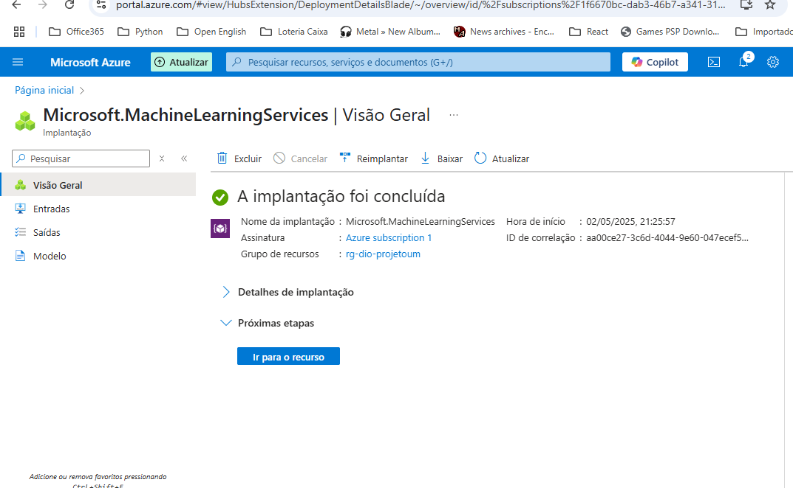
 

## Criando um novo Projeto
- Criando Projeto.
  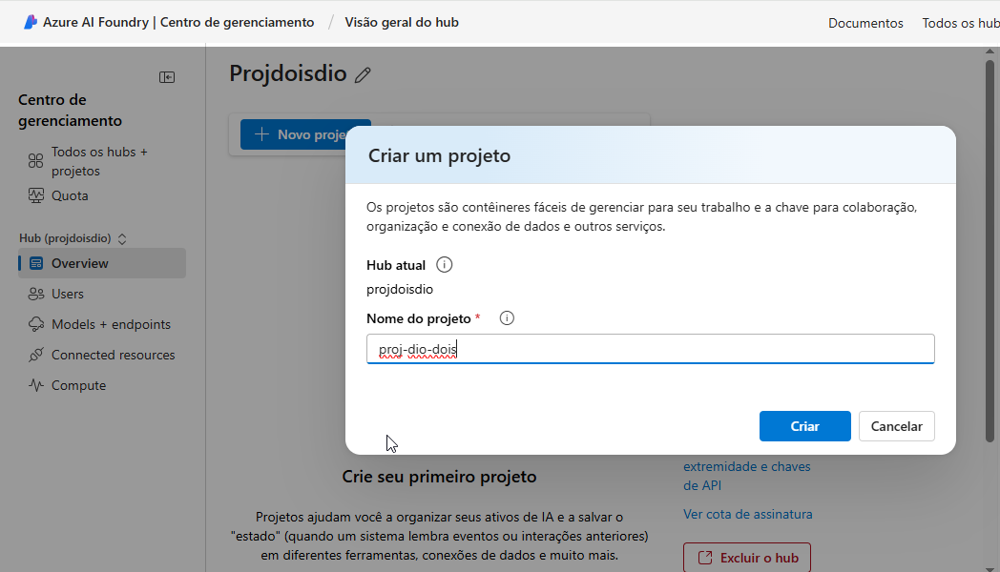

 - Projeto Criado.
    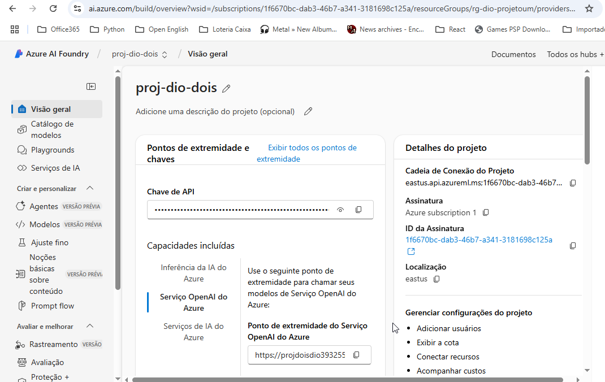

## Selecionando Modelo

- Selecionando o modelo GPT-4o.

    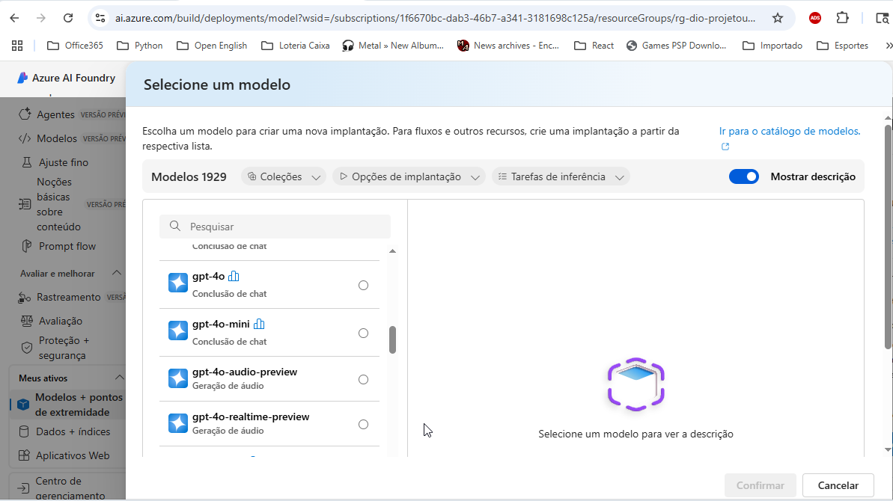

- Parametrizações customizadas de Tokens.

    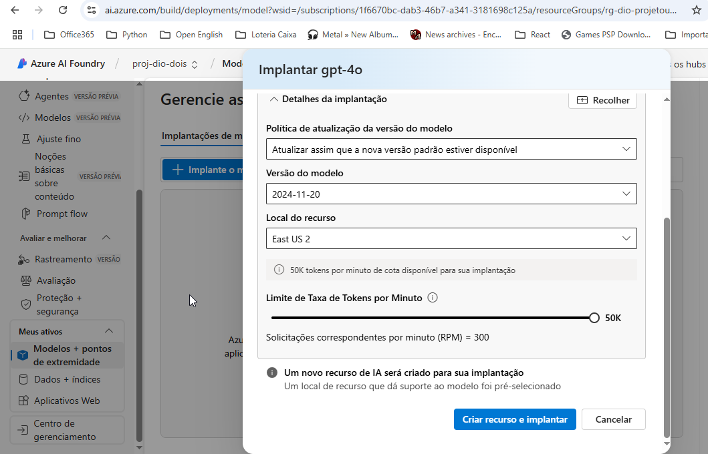

- Selecionado o modelo text-embedding-3-large, que transforma de texto para vetor e vetor para texto.

  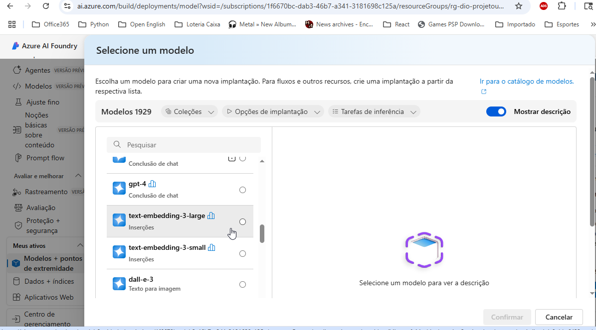
  
## Configuração de Playground de chat.

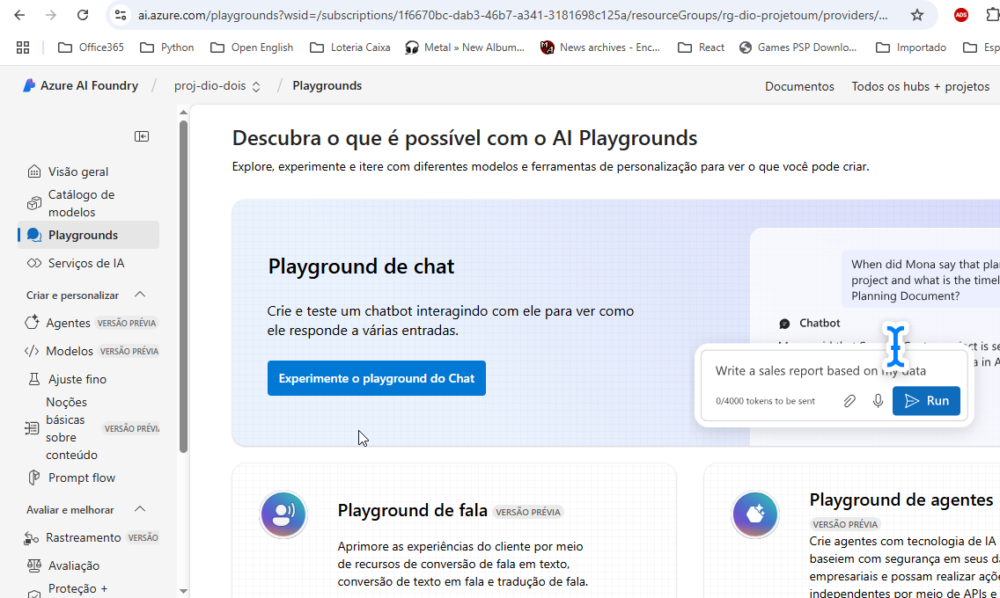
    
- Fornecendo as instrução do contexto para o modelo.

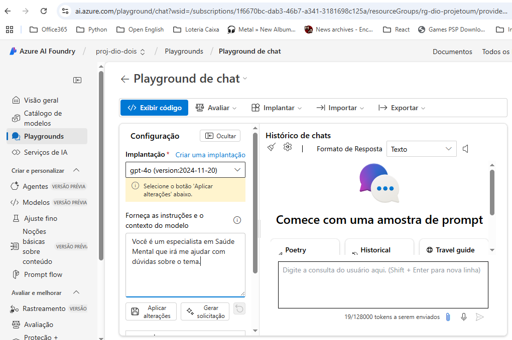
  
## Adicionando Azure IA Search.

- Neste caso é preciso adicionar Azure Ia search para criar os indices de pesquisa nos pdfs fornecidos.
   
  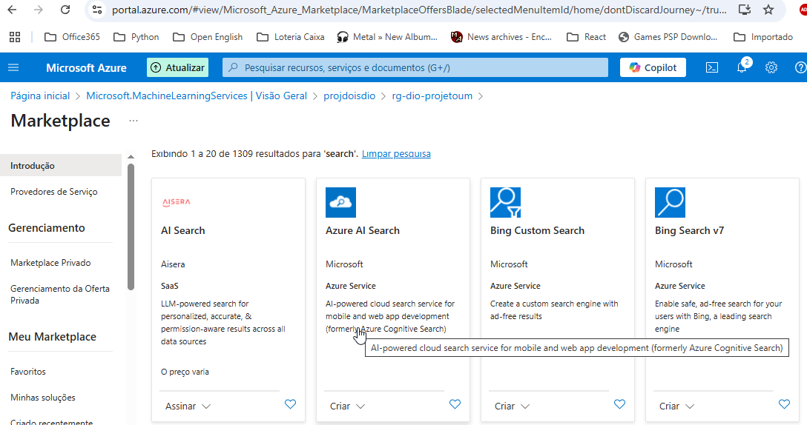

- Criando serviço de pesquisa.

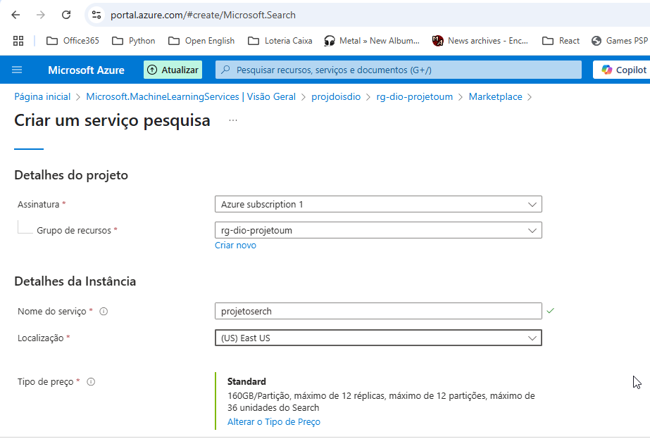

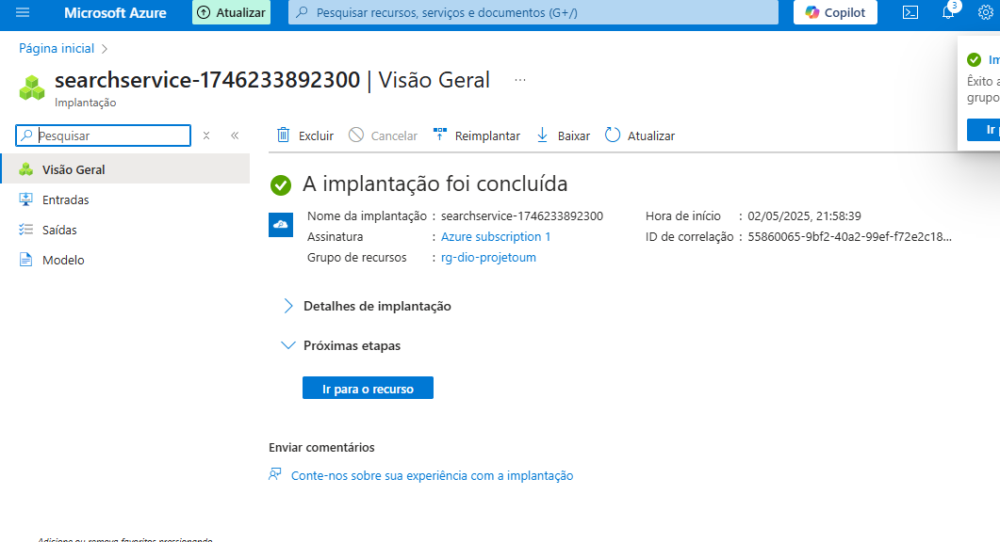

## Adicionando meus dados (pdfs).

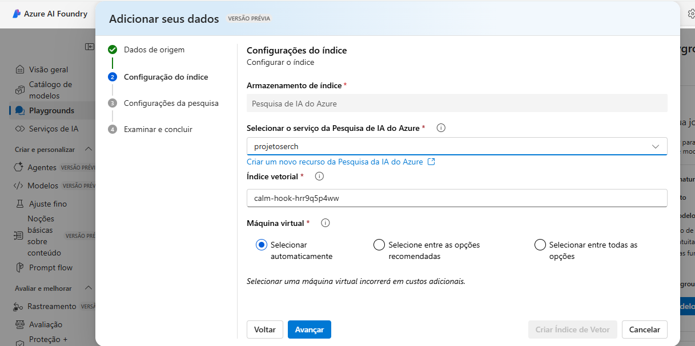

--Indice criado.

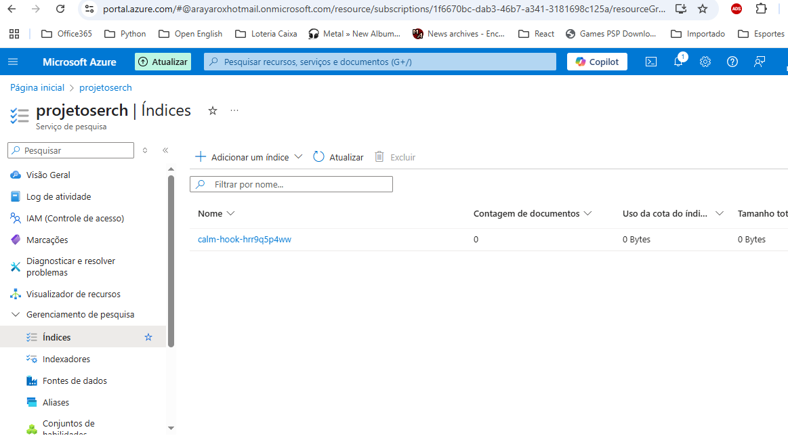
  
## Realizando testes do chat criado.

- Veja que neste caso perguntei "O que é saúde mental?"

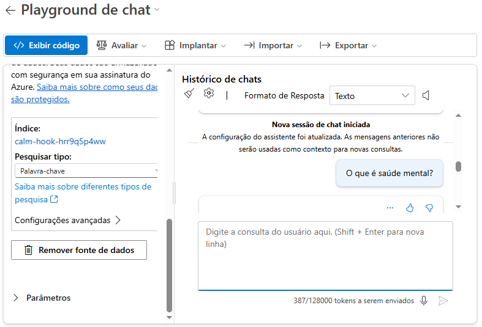
  
- Retornou apontando duas referências da minha base de dados.

  

- Selecionei uma parte do pdf Um desafio para a saúde pública.pdf para perguntar ao chat.

  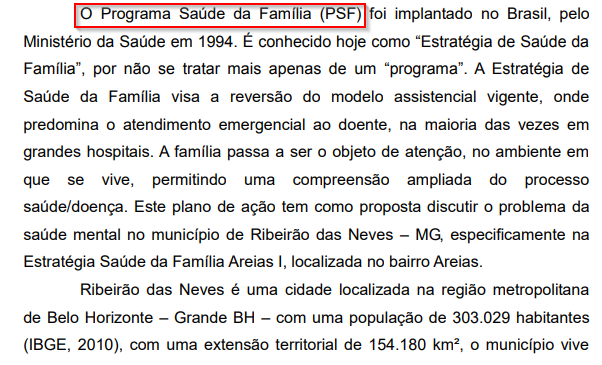
  
- Segue retorno.

  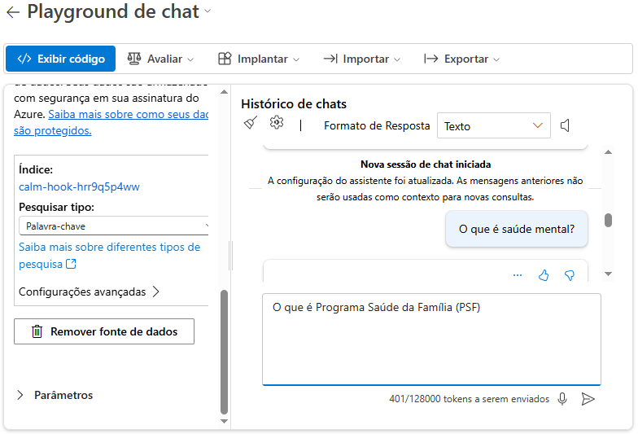

- Veja que usou o pdf que utilizei de exemplo como refência.

 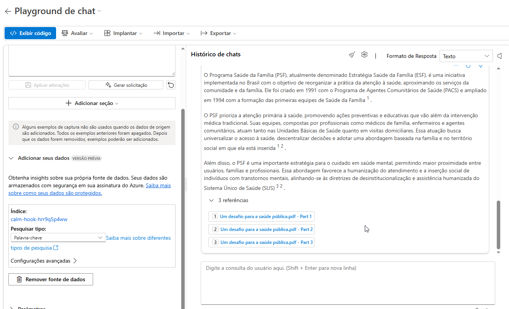

## Conclusões e Possibilidades

A criação deste chatbot baseado em inteligência artificial mostrou-se extremamente eficiente para lidar com grandes volumes de informação textual, como artigos científicos e documentos técnicos. A capacidade de transformar conteúdo em representações vetoriais, combinada com a busca semântica, permite extrair insights de forma precisa e contextualizada.

Com esse sistema, é possível:

📚 Acelerar o processo de revisão bibliográfica em projetos acadêmicos.

🔍 Localizar rapidamente trechos específicos em documentos extensos.

💬 Criar uma interface de perguntas e respostas baseada em conteúdo personalizado.

🌐 Escalar para uso em outras áreas, como jurídico (análise de jurisprudência), saúde (prontuários médicos), ou educação (materiais de aula).

O uso do Azure AI Foundry facilitou a criação de uma pipeline completa, integrando modelos de linguagem, embeddings e mecanismos de busca em uma mesma plataforma.

## Considerações Finais

Este projeto demonstrou como a combinação de inteligência artificial com técnicas modernas de recuperação de informações pode transformar a forma como interagimos com documentos complexos. A abordagem utilizada não só melhora a eficiência na busca por informações, como também abre caminho para assistentes personalizados de leitura, que auxiliam na compreensão e análise de conteúdo.

Durante o desenvolvimento, foi possível aprender na prática sobre:

A estruturação de projetos com IA generativa no Azure.

A aplicação de modelos de embedding para indexação semântica.

A criação de experiências interativas de chat com contexto personalizado.

O resultado final é uma solução prática e aplicável para qualquer cenário que envolva muitos textos e necessidade de respostas precisas com base em conteúdo real.
